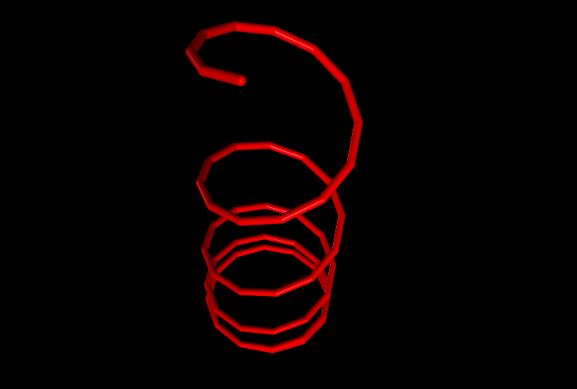
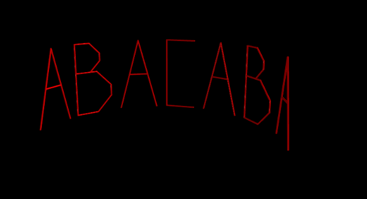

# Pràctica de LP: Turtle3D

Utilitzant Logo3D, una millora del llenguatge LOGO, podrem crear formes en un espai de 3 dimensions.

## Com instal·lar

Es proporcionen 5 fitxers + tests (programes escrits en LOGO3D): 
 - `requirements.txt`
 - `logo3d.g`
 - `logo3d.py`
 - `visitor.py`
 - `turtle3d.py`
 - `test-*.l3d`

Abans de tot hem de tenir instal·lat python i pip3. Un cop fet, descarreguem els arxius i instal·lem els requeriments:

```bash
pip3 install -r requirements.txt
```

Amb aquesta comanda s'instal·larà `vpyton`.

Per a poder instalar `antlr4` visiteu la seva pàgina de [Github](https://github.com/antlr/antlr4/blob/master/doc/getting-started.md).

## Com executar

Primer hem de compilar la gramàtica:
```bash
antlr4 -Dlanguage=Python3 -no-listener -visitor logo3d.g
```
Després, ja podem executar els nostres programes. Per exemple:
```bash
python3 logo3d.py test-1.l3d
```
El programa ofereix diverses maneres d'executar-se:
1.  ``python3 logo3d.py test.l3d`` --> Per defecte procediment main es l'inicial
2.  ``python3 logo3d.py procediment test.l3d`` --> Procediment inicial es 'procediment', sense parametres
3.  ``python3 logo3d.py procediment p1 p2 p3 ... test.l3d`` --> Procediment inicial es 'procediment', amb parametres p1, p2, p3, ...

## Exemples

### Exemple 1

Amb el codi de ``test-1.l3d``:

```
// Programa de demostracio en Logo3D.

PROC cercle(mida, costats) IS
    FOR i FROM 1 TO costats DO
        forward(mida)
        left(360 / costats)
    END
END

PROC espiral(cercles) IS
    IF cercles > 0 THEN
        cercle(1, 12)
        up(5)
        espiral(cercles - 1)
    END
END

PROC main() IS
    espiral(5)
END
```

obtenim la seguent imatge:
<p align="center">
  
</p>

### Exemple 3

Al ``test-3.l3d`` podem visualitzar cadenes de lletres formades per la A,B i C. Un exemple, afegint una rotació, és el següent:
<p align="center">
  
</p>

Ho hem pogut fer gràcies a funcions com la següent:
```
PROC b() IS
    up(90)
    forward(9.66)
    down(90)
    forward(1*2.05)
    down(45)
    forward(1*2.05)
    down(45)
    forward(0.5*2.05)
    down(45)
    forward(1*2.05)
    down(45)
    forward(1*2.05)
    up(180)
    forward(1*3)
    down(45)
    forward(1*3)
    down(45)
    forward(0.5*3)
    down(45)
    forward(1*3)
    down(45)
    forward(1*3)
    up(180)
    hide()
    forward(3+2.12+1.5)
    show()
END
```
